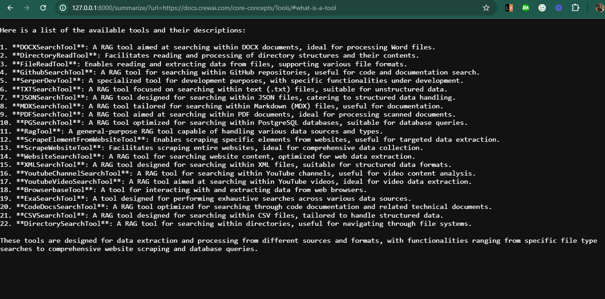

# WebBriefs

WebBriefs is an intelligent webpage summarizer API that extracts and condenses content into concise, readable markdown format. It is perfect for quickly getting the gist of any website.

## Features

- Extracts key information from any webpage.
- Provides summaries in markdown format for easy reading.
- Designed for researchers, students, and professionals who need quick insights.

## How It Works

WebBriefs uses advanced AI to analyze the content of a given webpage URL. It identifies the most relevant and useful information, then summarizes it into a clear and concise markdown format.

## Getting Started

### Prerequisites

- Python 3.8+
- Required Python packages: `fastapi`, `uvicorn`, `python-dotenv`, `crewai`, `crewai_tools`, `langchain_google_genai`

### Installation

1. **Clone the repository**:
    ```bash
    git clone https://github.com/yourusername/WebBriefs.git
    cd WebBriefs
    ```

2. **Install dependencies**:
    ```bash
    pip install fastapi uvicorn python-dotenv crewai crewai_tools langchain_google_genai
    ```

3. **Set up environment variables**:
    Create a `.env` file in the root directory and add your API keys:
    ```
    GEMINI_API_KEY=your_google_genai_api_key
    SERPER_API_KEY=your_serper_api_key
    OPENAI_API_KEY=your_openai_api_key
    ```

### Running the Application

1. **Start the FastAPI server**:
    ```bash
    uvicorn app:app --reload
    ```

2. **Access the API**:
    Open your browser and go to `http://127.0.0.1:8000/` to read the instructions.

3. **Summarize a webpage**:
    To get a summary, visit:
    ```
    http://127.0.0.1:8000/summarize/?url=https://example.com
    ```
    Replace `https://example.com` with the URL of the webpage you want to summarize.

## Usage

- **Home Route (`/`)**: Provides instructions on how to use the API.
- **Summarize Route (`/summarize/`)**: Accepts a URL as a query parameter and returns the summarized content in markdown format.

## Example

If you want to summarize the content of `https://example.com`, use the following URL:
```
http://127.0.0.1:8000/summarize/?url=https://example.com
```
You will receive a markdown-formatted summary of the webpage content.



## Deployment

To deploy WebBriefs on Hugging Face Spaces or any other cloud platform, follow their specific deployment instructions and ensure the environment variables are set accordingly.

## License

This project is licensed under the MIT License. See the [LICENSE](LICENSE) file for details.

## Contact

For questions or suggestions, please open an issue on GitHub or contact us at [ashad001sp@gmail.com].

---

Thank you for using WebBriefs! Hope it helps you save time and enhance your productivity by providing quick insights from any webpage.